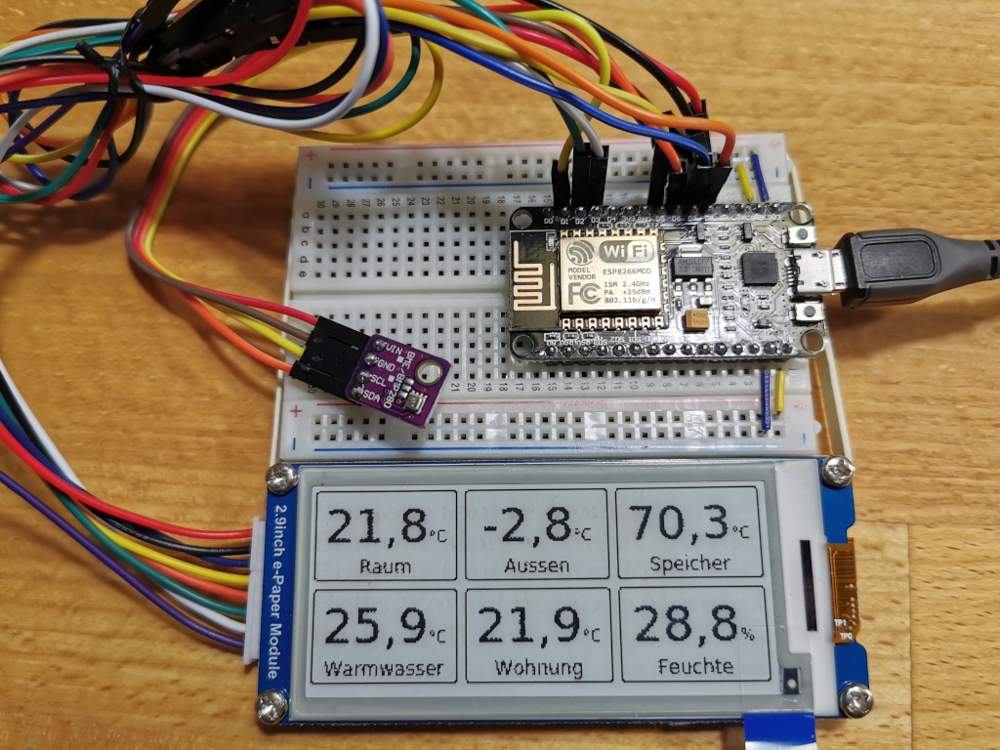
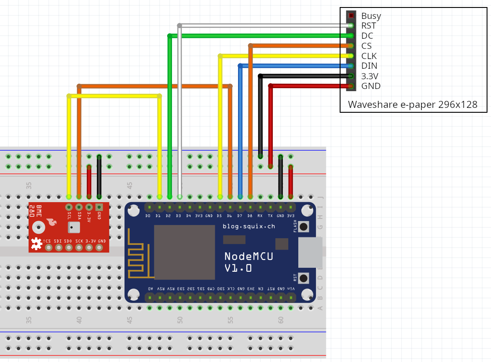

# Informate

From <https://en.wikipedia.org/wiki/Informating>:

> Informating [...] is the process that translates descriptions and measurements of activities, events and objects into information. By doing so, these activities become visible to the organization. 

## What is this

This is a firmware for ESP8266 processors and a connected display to display an image, provided as XBM-like data by a webserver.
Currently supported is a Waveshare 2.9" e-paper display, connected by 4-Wire SPI.

I use it to display some temperatures and the current humidity in my bathroom so that I know if the water is on temperature *before* I enter the shower, or if the room needs airing.

## Hardware



The prototype consits of

* [ESP8266F](https://amzn.to/35gbEiF)* on a NodeMCU board
* Waveshare [e-Paper display](https://amzn.to/2L40eaQ)*, 2.9" 296x128 pixel resolution
* [BME280 temperature/humidity/pressure sensor](https://amzn.to/3berZIn)* (optional)

And, of course, a [breadboard and some wires](https://amzn.to/3s161P0)*.

Wire it like this:


## Building the firmware

Build this project is convenient with [PlatformIO](https://docs.platformio.org/en/latest/core/installation.html) and git.

The following instructions are for Linux on the command line.

First, check out the sourcecode:

```bash
git clone git@github.com:ThomasKeil/InforMate.git
cd InforMate
```

### Configuration

Create some files:

```bash
cp platformio.dist.ini platformio.ini
cp src/config.dist.h src/config.h
```

Make the neccessary changes in these files.

```c++
// config.h

// The URL to the script providing the XBM-Data
#define INFOURL "http://url.to.your.script/waveshare2.9.html.php"

// The SSID of your WiFi network
#define SSID "YOURSSID"

// The password of the wifi password
#define PASSWORD "YOURPASSWORD"
```

`platformio.ini` defines one environment, `default`.
If you build more than one InforMate it's probably a good idea to [define more environments](https://docs.platformio.org/en/latest/projectconf/section_env.html#projectconf-section-env) here and use `-D` build flags to `#ifdef` switch some parts in `config.h`. See the example in the code.

### Build

Run this command in the InforMate directory:

```bash
pio run -e default -t upload
```

This downloads and installs all neccessary libraries, builds the firmware and automatically uploads it to the ESP8266 (which needs to be already connected via USB).

To see some debug output use this command:

```bash
pio device monitor
```

### Debugging stackdumps on the serial console

More like a note for me, but use this if necessary.

```bash
java -jar /path/to/EspStackTraceDecoder.jar /path/to/addr2line .pio/build/YOURENVIRONMENT/firmware.elf STACKTRACEFILE
```

Obtain EspStacktraceDecoder at [https://github.com/littleyoda/EspStackTraceDecoder](https://github.com/littleyoda/EspStackTraceDecoder)

`addr2line` is part of the GNU binutils.

## The Server

The directory [web](web) contains some examples how to create the neccessary data.

The firmware requests data from a URL and expects a payload with either the XBM data or an error message. 

If a BME280 sensor is connected, the request provides temperature and humidity as measured by the sensor.

It looks like this:

```logfile
GET /waveshare2.9.html.php?temperature=20.63&humidity=35.90 
```

The response needs to be either of these two formats:

XBM Data:

```binary
XBM: 1FEDBEEF....
```

Error message:

```binary
Error: Whatever is wrong
```

The examples do this in two steps:

* Render a web page with the desired data
* Convert the web page to a [XBM image](https://en.wikipedia.org/wiki/X_BitMap) and transmit the neccessary bytes

This makes it exceptionally simple to create nice results in no time.

In the provided examples [example.php](web/example.php) does the rendering and [waveshare2.9.html.php](web/waveshare2.9.html.php) is doing the converting and transmitting.

The data is obtained by creating a snapshot of the website with the help of [wkhtmltoimage](https://wkhtmltopdf.org/) and then converting it to XBM with `convert` by the [ImageMagick](https://imagemagick.org/script/convert.php) project.

If you want to use the provided scripts you need to install these binaries and provided the path in the script.

## Disclaimer

The links marked with an asterisk(*) are Amazon affiliate links. If you buy your equipment for this project with these links, I'll receive a few cents.